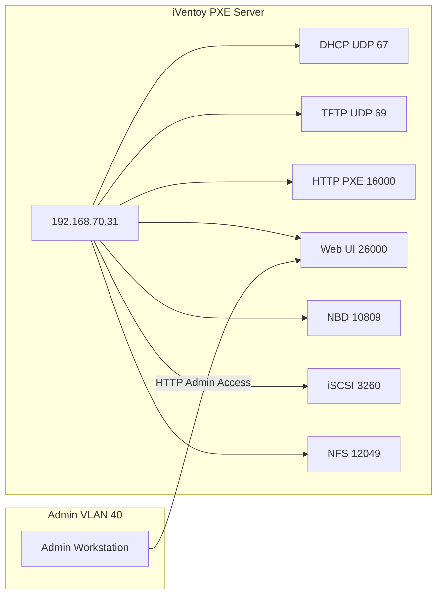

# PXE iVentoy Infrastructure

A PXE boot infrastructure based on **iVentoy**, used for network booting ISO images across VLAN-segmented environments with controlled administrative access and persistent configuration across reboots.
This repository serves as a **living documentation source** prior to full Infrastructure-as-Code (Ansible) conversion.
---
## Installation Model
iVentoy is deployed as a manually extracted binary distribution rather than a package-managed application.

Current deployment method:
- Download official tarball from iVentoy releases
- Extract to `/opt/iventoy`
- Start via systemd service

### Upgrade Process
Upgrades are currently manual and documented here:
https://www.iventoy.com/en/doc_update.html

Process:
1. Stop iVentoy service
2. Replace `/opt/iventoy` contents with new version
3. Ensure `config.dat` is preserved
4. Restart service

### Upgrade Frequency

Upgrades are performed only when:
- Critical security fixes are released
- Functional issues require resolution
- New PXE features are required

## Overview
This environment provides network boot capabilities using iVentoy, enabling:

- PXE booting of Windows and Linux ISO images
- Centralized  boot menu management
- DHCP + TFTP + HTTP PXE services
- VLAN-separated access control for administration vs clients
- Persistent configuration across system reboots
---

## Architecture


 DHCP (67) TFPT (69) HTTP PXE
 PXE Boot Bootloader ISO Menu
 ---
 ## Network Configuration

 | Component | Value |
 | ----------|-------|
 | Server IP | `192.168.70.31` |
 | PXE VLAN | `192.168.70.0/24` |
 | Admin VLAN | `192.168.40.0/24` |
 | Interface | `enp0s31f6` |

 ---
 ## Services Provided

 iVentoy runs multiple PXE-related services:

 | Service | Port | Purpose |
 | --------|------|-------|
 | DHCP | UDP 67 | PXE address assignment |
 | TFTP | UDP 69 | Boot file delivery |
 | HTTP PXE | TCP 16000 | Boot menu + API |
 | HTTP UI | TCP 26000 | Web interface |
 | NBD | TCP 10809 | Disk streaming |
 | iSCSI | TCP 3260 | Block device boot |
 | NFS | TCP 12049 | File system boot |

 ---

 ## Installation Context
 - Deployed on a **KVM virtual machine**
 - iVentoy installed under:

 ```bash
 /opt/iventoy
 ```
 - ISO images stored under:
 ```bash
 /opt/iventoy/data/
 ```
 > Exact initial installation method is currently undocumented (manual extraction assumed).
 ---
 ## Persistent Configuration
 Main configuration file:
 ```bash
 /opt/iventoy/data/config.dat
 ```

 ### Backup procedure
 ```bash
 cp -a /opt/iventoy/data /opt/iventoy/data.backup_$(date +%F)
 ```

## Server Setup (iVentoy PXE Host)
This section describes how to deploy the iVentoy PXE server on a fresh Linux system.
---
### Prerequisites
- Linux server (systemd-based distro)
- Root or sudo access
- Network interface with static IP (example: `192.168.70.31`)
- KVM environment (current deployment context)
- Open ports:
    - UDP: 67 (DHCP), 69 (TFTP)
    - TCP: 16000/26000 (HTTP PXE / Web UI)
    - TCP: 10809 (NBD)
    - TCP: 3260 (iSCSI)
    - TCP: 12049 (NFS)
---
### Installation Directory
iVentoy is installed in:
```bash
/opt/iventoy
```
Expected structure:
```bash
/opt/iventoy/
├── iventoy.sh
├── lib/
├── data/
│ ├── config.dat
│ └── ...
├── iso/
│ ├── Windows 11 25H2 v2.iso
│ ├── Ubuntu v26.04.iso
│ └── Utilities/
└── log/
```
---
### ISO Storage
All bootable images are stored under:

```bash
/opt/iventoy/data/iso/
```
Example structure:
```bash
iso/
├── Windows 11 25H2 v2.iso
├── Windows 10 22H2.iso
├── Ubuntu v26.04.iso
└── Utilities/
├── Hiren's BootCD PE.iso
└── Macrium Rescue.iso
```
---
### First-Time Startup
Start iVentoy manually:

```bash
cd /opt/iventoy
sudo ./iventoy.sh start
```

## Persistent Startup (Systemd)
iVentoy is managed via a custom systemd service to ensure it starts automatically on boot and survives reboots.
---
### Service File Location
```bash
/etc/systemd/system/iventoy.service
```
---
### Service Configuration
```ini
[Unit]
Description=iVentoy PXE Server
After=network.target

[Service]
Type=simple
WorkingDirectory=/opt/iventoy
ExecStart=/opt/iventoy/iventoy.sh -R start
ExecStop=/opt/iventoy/iventoy.sh stop
Restart=always

[Install]
WantedBy=multi-user.target
```
### Enable and Start Service
```bash
sudo systemctl daemon-reload
sudo systemctl enable iventoy
sudo systemctl start iventoy
```
---
### Restart Service
```bash
sudo systemctl restart iventoy
```
---
### Check Service Status
```bash
sudo systemctl status iventoy
```
---
### Verify Service is Enabled
```bash
sudo systemctl is-enabled iventoy
```
### Important Note (`-R` Flag)
The `-R` flag is required when starting iVentoy via systemd to ensure PXE-related services are automatically initialized and restored after a reboot.
Example:
```bash
sudo ./iventoy.sh -R start
```

Systemd configuration:

```ini
ExecStart=/opt/iventoy/iventoy.sh -R start
```

### What the `-R` Flag Does

- Recovers settings from `data/config.dat`
- Restores PXE configuration automatically
- Starts DHCP services in the configured mode (ProxyNet/Internal)
- Start TFTP services
- Starts HTTP PXE services
- Reloads and indexes configured ISO images
- Restores User Filter and MAC Filter settings
- Restores default boot image configuration

#### Symptoms When `-R` Is Missing

The iVentoy process may appear to be running, but PXE functionality may not be available.

Common symptoms include:

- No DHCP service listening on UDP 67
- No TFTP service listening on UDP 69
- PXE clients fail to boot
- PXE menu is unavailable
- Services must be manually started from the Web UI

#### Verification

Check the log after startup:

```bash
tail -f /opt/iventoy/log/log.txt
```

A healthy startup should contain entries similar to:

```text
DHCP service is running
TFTP service is running
HTTP PXE services is running
iVentoy entering main loop
```
## Samba Shares
The PXE server exposes the following SMB shares for administrative use:

| Share | Path | Purpose | 
|-------|------|----------|
| iVentoy-ISO | `/opt/iventoy/iso` | ISO image repository |
| iVentoy-Scripts | `/opt/iventoy/user/scripts` | Unattended deployment files (Autunattend, Kickstart, Preseed, AutoYaST, etc.) |

### Verify Shares

```bash
testparm -s | grep '^\['
```

Expected output:

```text
[iVentoy-ISO]
[iVentoy-Scripts]
```

### Check Samba Service

```bash
sudo systemctl status smbd
sudo systemctl is-enabled smbd
```

### iVentoy User Content
The `iVentoy-Scripts` share exposes `/opt/iventoy/user`, which is used for:

- Autounattend XML files
- Kickstart configurations
- Preseed files
- AutoYaST files
- Injection files (namely, `set.me`)
- Other custom deployment assets referenced by iVentoy


