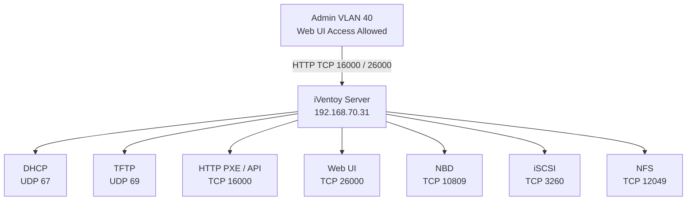

# PXE iVentoy Infrastructure

A PXE boot infrastructure based on **iVentoy**, used for network booting ISO images across VLAN-segmented environments with controlled administrative access and persistent configuration across reboots.
This repository serves as a **living documentation source** prior to full Infrastructure-as-Code (Ansible) conversion.
---

## Overview
This environment provides network boot capabilities using iVentoy, enabling:

- PXE booting of Windows and Linux ISO images
- Centralized  boot menu management
- DHCP + TFTP + HTTP PXE services
- VLAN-separated access control for administration vs clients
- Persistent configuration across system reboots
---

## Architecture


 DHCP (67) TFPT (69) HTTP PXE
 PXE Boot Bootloader ISO Menu
 ---
 ## Network Configuration

 | Component | Value |
 | ----------|-------|
 | Server IP | `192.168.70.31` |
 | PXE VLAN | `192.168.70.0/24` |
 | Admin VLAN | `192.168.40.0/24` |
 | Interface | `enp0s31f6` |

 ---
 ## Services Provided

 iVentoy runs multiple PXE-related services:

 | Service | Port | Purpose |
 | --------|------|-------|
 | DHCP | UDP 67 | PXE address assignment |
 | TFTP | UDP 69 | Boot file delivery |
 | HTTP PXE | TCP 16000 | Boot menu + API |
 | HTTP UI | TCP 26000 | Web interface |
 | NBD | TCP 10809 | Disk streaming |
 | iSCSI | TCP 3260 | Block device boot |
 | NFS | TCP 12049 | File system boot |

 ---

 ## Installation Context
 - Deployed on a **KVM virtual machine**
 - iVentoy installed under:

 ```bash
 /opt/iventoy
 ```
 - ISO images stored under:
 ```bash
 /opt/iventoy/data/
 ```
 > Exact initial installation method is currently undocumented (manual extraction assumed).
 ---
 ## Persistent Configuration
 Main configuration file:
 ```bash
 /opt/iventoy/data/config.dat
 ```

 ### Backup procedure
 ```bash
 cp -a /opt/iventoy/data /opt/iventoy/data.backup_$(date +%F)
 ```

## Server Setup (iVentoy PXE Host)
This section describes how to deploy the iVentoy PXE server on a fresh Linux system.
---
### Prerequisites
- Linux server (systemd-based distro)
- Root or sudo access
- Network interface with static IP (example: `192.168.70.31`)
- KVM environment (current deployment context)
- Open ports:
    - UDP: 67 (DHCP), 69 (TFTP)
    - TCP: 16000/26000 (HTTP PXE / Web UI)
    - TCP: 10809 (NBD)
    - TCP: 3260 (iSCSI)
    - TCP: 12049 (NFS)
---
### Installation Directory
iVentoy is installed in:
```bash
/opt/iventoy
```
Expected structure:
```bash
/opt/iventoy/
├── iventoy.sh
├── lib/
├── data/
│ ├── config.dat
│ ├── iso/
│ └── ...
└── log/
```
---
### ISO Storage
All bootable images are stored under:

```bash
/opt/iventoy/data/iso/
```
Example structure:

iso/
├── Windows 11 25H2 v2.iso
├── Windows 10 22H2.iso
├── Ubuntu v26.04.iso
└── Utilities/
├── Hiren's BootCD PE.iso
└── Macrium Rescue.iso

---
### First-Time Startup
Start iVentoy manually:

```bash
cd /opt/iventoy
sudo ./iventoy.sh start
```


